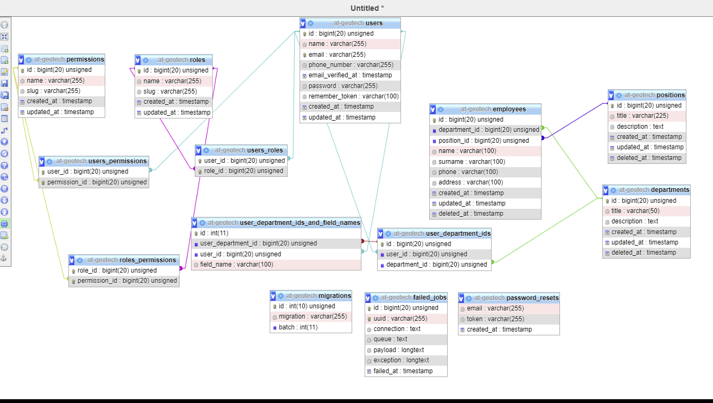
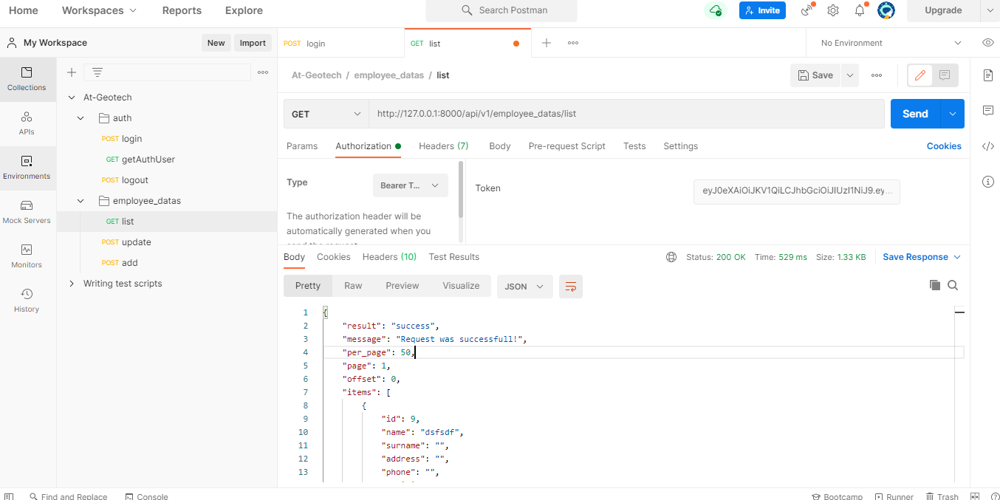
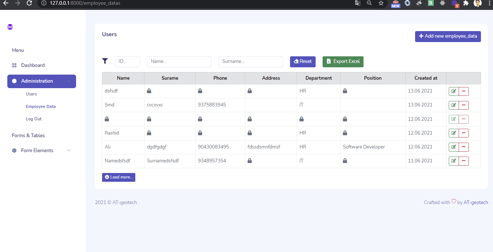
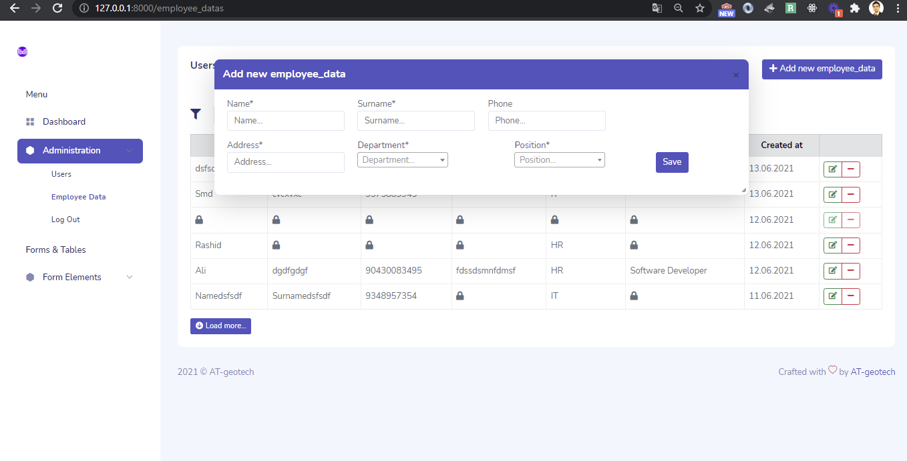
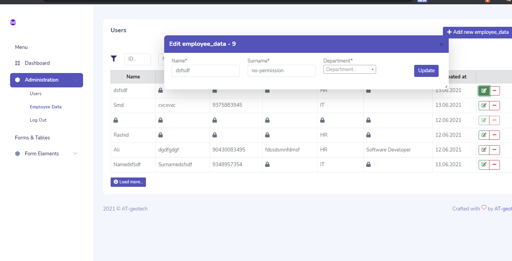

```
git clone repository
composer install
composer dump-autoload
cp .env.example .env
php artisan key:generate
<!-- php artisan migrate -->

php artisan cache:clear
php artisan route:clear
php artisan config:clear
php artisan view:clear

php artisan make:model Permission -m
php artisan make:model Role -m

composer require tymon/jwt-auth --ignore-platform-reqs
```

### Application is web and api based

- db exported file db.sql in info folder
* db structure
  

* API's
  

* All data list
  

* Add data 
  
  
* Edit data 
  